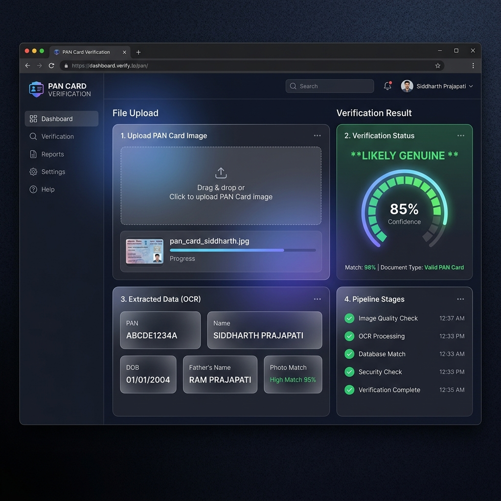
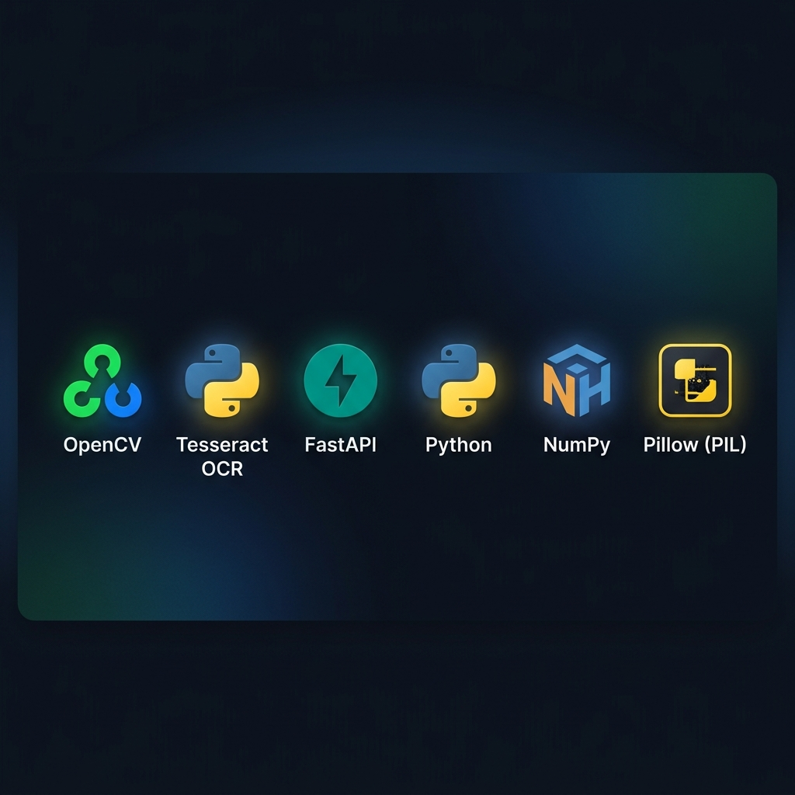
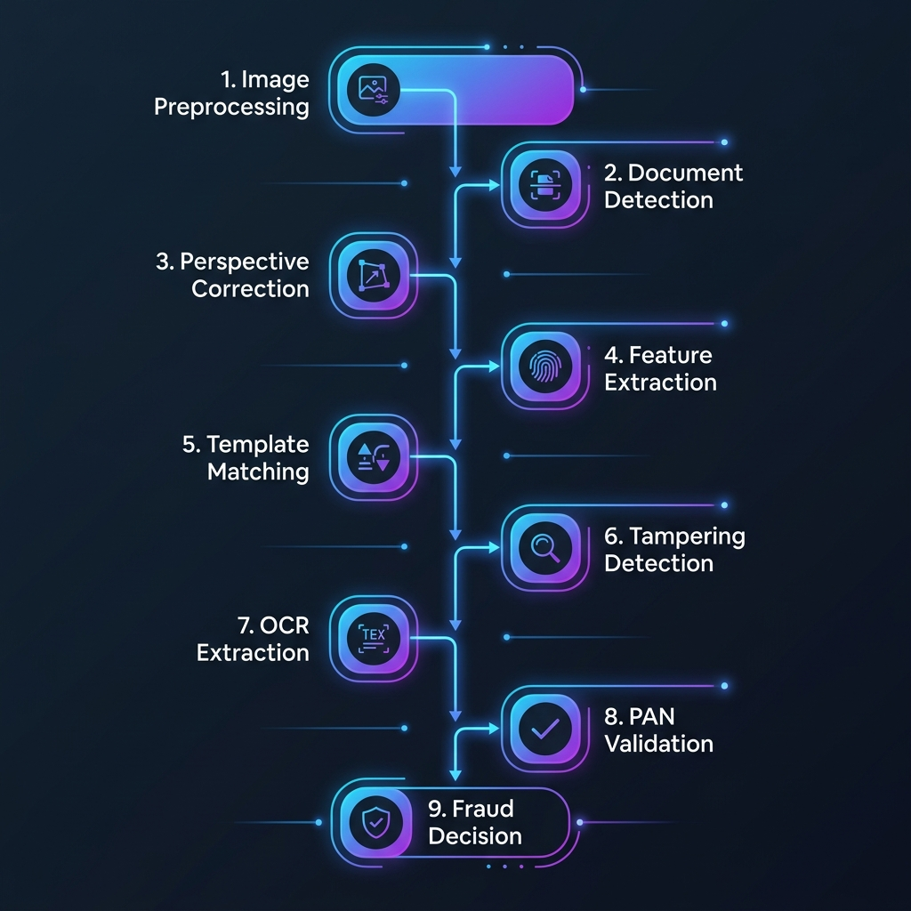

<](https://python.org)
[](https://opencv.org)
[](https://fastapi.tiangolo.com)
[](https://github.com/tesseract-ocr/tesseract)
[](#-license)

</div>

---

## 📸 Dashboard Preview

<div align="center">
  
  <br/>
  <em>Premium glassmorphic web dashboard showing real-time PAN card verification results</em>
</div>

---

## 📝 Overview

This project is a **full-stack AI-powered system** that verifies Indian PAN (Permanent Account Number) card images and detects possible forgery or tampering. It uses a **9-phase computer vision pipeline** combining classical image processing, multi-strategy OCR, rule-based validation, and a weighted fraud decision engine.

The system processes uploaded PAN card images through detection, perspective correction, feature matching, tampering analysis, and OCR extraction — finally delivering a confidence-scored verdict: **Genuine**, **Needs Manual Review**, or **Fraudulent**.

---

## 🧰 Technology Stack

<div align="center">
  
</div>

<br/>

| Technology | Version | Purpose |
|:-----------|:--------|:--------|
| **Python** | 3.10+ | Core programming language |
| **OpenCV** | 4.9.0 | Image processing, edge detection, contour analysis, perspective transforms |
| **Tesseract OCR** | 5.x | Optical character recognition for text extraction from PAN cards |
| **pytesseract** | ≥0.3.10 | Python wrapper for Tesseract engine |
| **FastAPI** | ≥0.100 | High-performance async REST API backend |
| **Uvicorn** | ≥0.22 | ASGI server for running FastAPI |
| **NumPy** | ≥1.26 | Array operations and mathematical computations |
| **Pillow (PIL)** | ≥10.0 | Image format conversions for Tesseract |
| **Jinja2** | ≥3.1 | HTML template rendering for the frontend |
| **Pydantic** | ≥2.0 | Data validation and API request/response models |
| **HTML5 / CSS3 / JS** | — | Premium glassmorphic frontend dashboard |

---

## ✨ Key Features

- 🔍 **9-Phase Verification Pipeline** — Comprehensive multi-stage analysis from preprocessing to fraud decision
- 🧠 **Multi-Strategy OCR** — Tests 5 preprocessing variants × multiple PSM modes per field, picks highest confidence
- 🔧 **OCR Post-Correction** — Character confusion resolution (O↔0, I↔1, B↔8, etc.) with exhaustive substitution search
- 📐 **RANSAC Perspective Correction** — Robust homography estimation to correct skew, rotation, and perspective distortion
- 🖼️ **Contour-Based Document Detection** — Automatic PAN card boundary detection with aspect-ratio filtering
- 🧪 **Tampering Detection** — ELA (Error Level Analysis), texture uniformity checks, and noise pattern analysis
- ✅ **PAN Format Validation** — Regex validation, holder-type code verification, and character-level structural checks
- 📊 **Weighted Fraud Decision Engine** — Combines all signals into a single fraud probability score
- 🎨 **Premium Web Dashboard** — Dark glassmorphic UI with real-time progress, animated gauges, and detailed result cards

---

## 🏗️ Pipeline Architecture

<div align="center">
  
</div>

<br/>

| Phase | Module | Description |
|:-----:|:-------|:------------|
| 1 | `preprocessing.py` | Noise reduction, contrast enhancement (CLAHE), sharpening, quality metrics |
| 2 | `detection.py` | Canny edge detection → contour analysis → boundary identification with aspect-ratio filter |
| 3 | `correction.py` | RANSAC-based homography → perspective warp to standard 856×540 canvas |
| 4–5 | `features.py` | ORB keypoint extraction → template matching against reference PAN layout |
| 6 | `tampering.py` | ELA analysis, texture uniformity, noise pattern detection for forgery signals |
| 7 | `ocr.py` | Multi-strategy Tesseract OCR: 5 preprocessing variants × multiple PSM modes per field |
| 8 | `validation.py` | PAN regex validation, holder-type check, DOB format verification, structural analysis |
| 9 | `decision.py` | Weighted score aggregation → fraud probability → final verdict classification |

---

## 📂 Project Structure

```text
DOCUMENT-VERIFICATION-AND-FRAUD-DETECTION-USING-AI-AND-COMPUTER-VISION/
│
├── assets/                       # README images and diagrams
│   ├── tech_stack.png            # Technology stack banner
│   ├── dashboard_preview.png     # Dashboard screenshot
│   └── pipeline_diagram.png      # 9-phase pipeline diagram
│
├── backend/                      # Python backend — core CV + OCR logic
│   ├── __init__.py               # Package initializer
│   ├── config.py                 # System config, Tesseract path auto-detection
│   ├── preprocessing.py          # Phase 1: Image cleanup & quality metrics
│   ├── detection.py              # Phase 2: Document boundary detection
│   ├── correction.py             # Phase 3: RANSAC perspective correction
│   ├── features.py               # Phase 4–5: ORB feature extraction & matching
│   ├── tampering.py              # Phase 6: Forgery & tampering detection (ELA)
│   ├── ocr.py                    # Phase 7: Multi-strategy Tesseract OCR engine
│   ├── validation.py             # Phase 8: PAN format & structural validation
│   ├── decision.py               # Phase 9: Weighted fraud decision engine
│   ├── cv_pipeline.py            # End-to-end pipeline orchestrator
│   ├── main.py                   # FastAPI routes & API endpoints
│   └── utils.py                  # Shared utilities (base64, resize, etc.)
│
├── frontend/                     # Premium glassmorphic web dashboard
│   ├── index.html                # Main HTML layout with semantic structure
│   ├── style.css                 # Dark theme CSS with glassmorphism effects
│   └── app.js                    # Frontend logic, API integration, animations
│
├── templates/                    # Reference templates for matching
│   └── PAN_CARD_TEMPLATE.jpeg    # Standard PAN card layout reference
│
├── PAN_CARD_TEMPLATE.jpeg        # Root-level template copy
├── SYSTEM_DESIGN.md              # Detailed architecture documentation
├── requirements.txt              # Python dependencies
├── run.py                        # Application entry point
├── .gitignore                    # Git ignore rules
└── README.md                     # This file
```

---

## 🚀 Installation & Setup

### Prerequisites

- **Python 3.10+**
- **Tesseract OCR** — must be installed on your system

#### Install Tesseract

<details>
<summary><b>macOS (Homebrew)</b></summary>

```bash
brew install tesseract
```
</details>

<details>
<summary><b>Ubuntu / Debian</b></summary>

```bash
sudo apt update && sudo apt install tesseract-ocr
```
</details>

<details>
<summary><b>Windows</b></summary>

Download the installer from [UB Mannheim Tesseract](https://github.com/UB-Mannheim/tesseract/wiki) and add the install path to your system `PATH`.
</details>

### Setup

```bash
# 1. Clone the repository
git clone https://github.com/YOUR-USERNAME/DOCUMENT-VERIFICATION-AND-FRAUD-DETECTION-USING-AI-AND-COMPUTER-VISION.git
cd DOCUMENT-VERIFICATION-AND-FRAUD-DETECTION-USING-AI-AND-COMPUTER-VISION

# 2. Create a virtual environment
python -m venv venv
source venv/bin/activate        # macOS / Linux
# venv\Scripts\activate          # Windows

# 3. Install dependencies
pip install -r requirements.txt

# 4. Run the application
python run.py
```

The server starts at **http://127.0.0.1:8000** — open it in your browser.

---

## 🖥️ Usage

1. **Open your browser** → navigate to `http://127.0.0.1:8000`
2. **Upload a PAN card image** — drag & drop or click the upload area
3. **View real-time pipeline progress** — each phase shows its status as it runs
4. **Review the verification results:**
   - 🟢 **Likely Genuine** — all checks passed with high confidence
   - 🟡 **Needs Manual Review** — some checks are borderline or low confidence
   - 🔴 **Likely Fraudulent** — multiple tampering or validation failures detected

### API Endpoint

You can also use the REST API directly:

```bash
curl -X POST http://127.0.0.1:8000/api/verify \
  -F "file=@your_pan_card.jpg"
```

**Response** includes detailed results from all 9 pipeline phases with confidence scores, extracted OCR text, validation checks, and the final fraud probability.

---

## 🧠 How the OCR Engine Works

The OCR module (`backend/ocr.py`) is the most sophisticated component, implementing a **multi-strategy approach**:

```
For each field (PAN, Name, Father's Name, DOB):
    1. Extract proportional ROI from corrected 856×540 image
    2. Generate 5 preprocessing variants:
       • Raw grayscale upscale
       • CLAHE + Otsu threshold
       • Adaptive Gaussian threshold
       • Inverted Otsu (re-inverted)
       • Bilateral filter + Otsu
    3. Try each variant × multiple PSM modes (psm 6, 7, 8)
    4. Pick the combination with highest Tesseract confidence
    5. Apply field-specific text cleaning
    6. For PAN: run OCR post-correction (character confusion resolution)
```

### OCR Post-Correction Example

```
Raw Tesseract output:  "ABCDE12340"    (O misread as 0)
After correction:      "ABCDE1234O"    ← single-character substitution
Validated against:     [A-Z]{5}[0-9]{4}[A-Z] ✅
```

---

## 📊 Sample Output

```
=== OCR Results ===
PAN:        "GRNPP3804H"   conf=86.0%   state=ok
Name:       "SIDDHARTH PRAJAPATI"   conf=91.5%   state=ok
FatherName: "INDERJEET PRAJAPATI"   conf=65.3%   state=low_conf
DOB:        "01/01/2004"   conf=73.8%   state=low_conf

Validation: SUCCESS (all structural checks passed)
Decision:   NEEDS MANUAL REVIEW (39.2% fraud probability)
```

---

## 📋 Dependencies

```txt
fastapi>=0.100.0
uvicorn>=0.22.0
python-multipart>=0.0.6
opencv-python==4.9.0.80
numpy>=1.26.0,<2.0
pytesseract>=0.3.10
Pillow>=10.0.0
jinja2>=3.1.2
pydantic>=2.0
```

---

## 🤝 Contributing

1. Fork the repository
2. Create a feature branch (`git checkout -b feature/amazing-feature`)
3. Commit your changes (`git commit -m 'Add amazing feature'`)
4. Push to the branch (`git push origin feature/amazing-feature`)
5. Open a Pull Request

---

## 📄 License

This project is for **educational and internal verification purposes**. When handling real Personally Identifiable Information (PII) such as PAN card images, ensure compliance with applicable data privacy regulations including the **Digital Personal Data Protection (DPDP) Act**.

---

<div align="center">

**Built with ❤️ using Python, OpenCV, Tesseract OCR & FastAPI**

</div>
]]>
